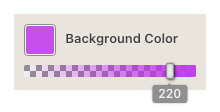

# Color Picker Web Component



Customizable color picker web component with alpha transparency support. The component provides a color input and a slider for alpha channel control.

## Features

- Color picker interface
- Alpha transparency control
- Supports both 3-digit (`#rgb`) and 6-digit (`#rrggbb`) hex colors
- Optional alpha channel in hex format (`#rrggbbaa`)
- Event handling for real-time color changes

## Installation

Grab a Javascript file from the `/dist` folder. The component is available in 2 flavors :

- ES module: `color-picker-es.js`
- IIFE format: `color-picker-iife.js`

### ES module

Import the component in your JavaScript file:

```javascript
import './path/to/color-picker.js';
```
Or the file as module:

```html
<body>
    <!-- ... -->
    <script src="color-picker.js" type="module"></script>
<body/>
```

### IIFE

This format wraps the code so that it can be consumed via a script tag in the browser while avoiding unwanted interactions with other code.

```html
<body>
    <!-- ... -->
    <script src="color-picker.js"></script>
<body/>
```

## Usage
Add the color picker to your HTML:

```html
<color-picker label="Choose color" value="#ff0000"></color-picker>
```

## Attributes


- `label`: Text label for the color picker (defaults to "Color Picker")
- `value`: Starting color value in hex format (`#rgb`, `#rrggbb`, `#rgba`, or `#rrggbbaa`). Color value defaults to `#000000` and transparency to `255`.


## Events

The component emits the following events:

- `input`: Triggered during color selection
- `change`: Triggered when the color selection is completed

## Return value

A string of the form `#rrggbbaa`.

## JavaScript Interface

Listen for color changes:

```js
const picker = document.querySelector('color-picker');

picker.addEventListener('input', (e) => {
    console.log('New color:', picker.value);
});
// Or
picker.addEventListener('change', (e) => {
    console.log('New color:', picker.value);
});
```

